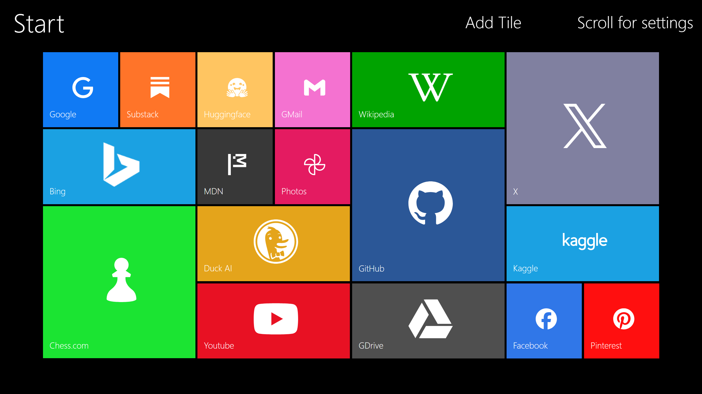
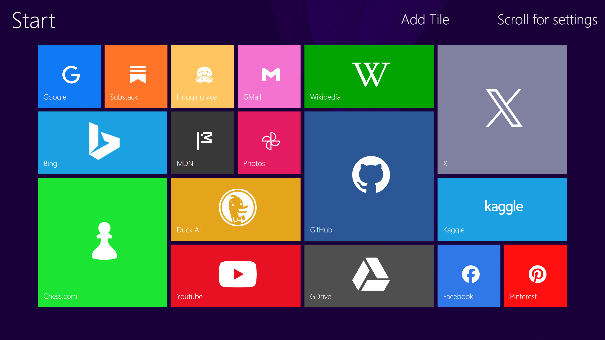
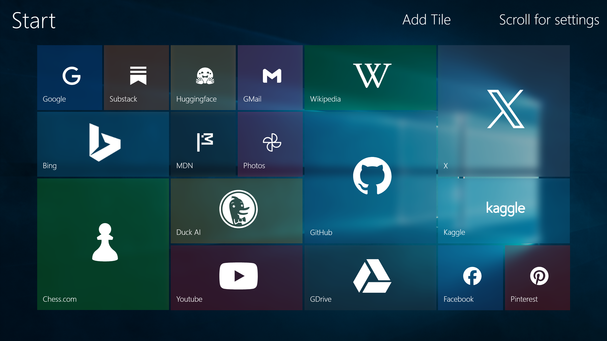
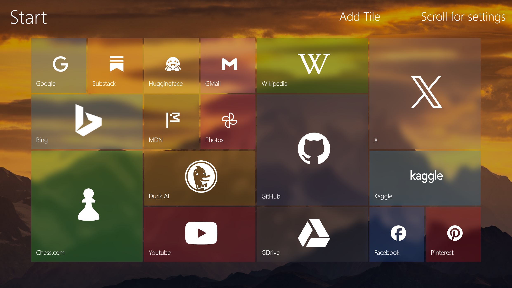

# Metro Start

A highly customizable browser startpage inspired by Metro design language. With built-in themes to replicate Window 8 and Windows 10's appearance. Store links as tiles, adjust colours, add translucency effects, custom icons, backgrounds and more.

## Screenshots

### Default

### Windows 8

### Windows 10

### Custom background
